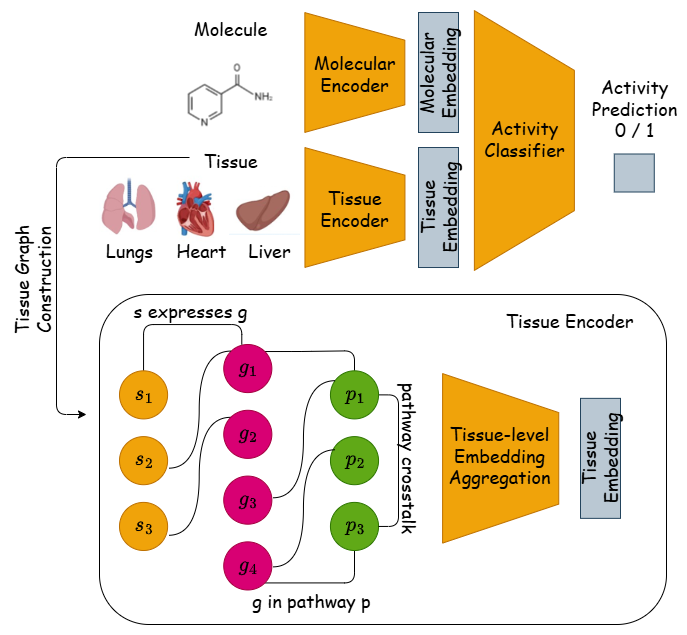

# 🚀 EXPRESSO: Mechanism-Aware Tissue-Specific Drug Activity Prediction

This repository contains the official implementation of our paper:
***“Mechanism-Aware Prediction of Tissue-Specific Drug Activity via Multi-Modal Biological Graphs”***

**EXPRESSO** is a multi-modal model that predicts tissue-specific molecular activity by integrating SMILES-based molecule embeddings with biological context from transcriptomic and pathway-level data. It constructs heterogeneous Sample–Gene–Pathway graphs and encodes them using hierarchical GNNs, producing tissue-aware molecular predictions.

<p align="center">
  
</p>

---

## ⚙️ Environment Setup

We recommend using `mamba` or `conda` to install dependencies:

```bash
mamba env create -f env.yml
mamba activate expresso
```

---

## 🧭 Running the Model

To train the model:

```bash
python main.py
```

Checkpoints will be saved automatically in:

```
checkpoints/
```

---

## 📊 Evaluation

To evaluate a trained model:

```bash
python evaluate.py --save_path checkpoints/best_model.pt
```

---

## 📂 Data Preparation

To prepare gene expression and pathway data, follow the detailed instructions in:

```
data_preprocessing/README.md
```

---

## 📝 Citation

If you use EXPRESSO in your work, please cite:

```
TODO
```
